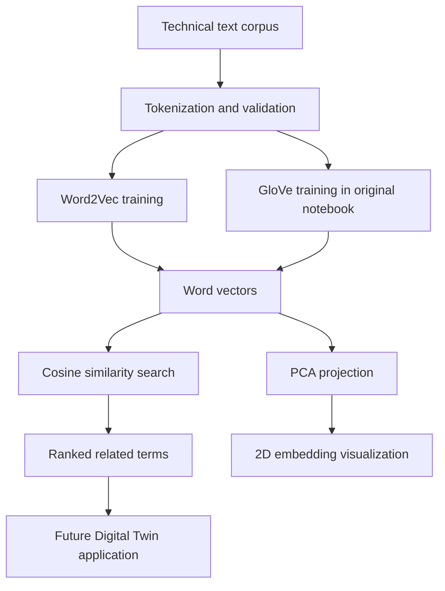

# Architecture

```mermaid
flowchart TD
    A[Technical text corpus] --> B[Tokenization and validation]
    B --> C[Word2Vec training]
    B --> D[GloVe training in original notebook]
    C --> E[Word vectors]
    D --> E
    E --> F[Cosine similarity search]
    F --> G[Ranked related terms]
    E --> H[PCA projection]
    H --> I[2D embedding visualization]
    G --> J[Future Digital Twin application]
```

Note: The original Colab notebook contains the user's custom GloVe implementation. The packaged demo trains Word2Vec only.
